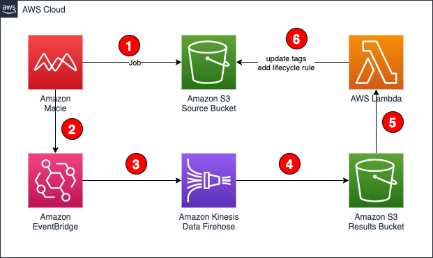

# Automate the archival and deletion of sensitive financial data using Amazon Macie

### Table of contents

1. [Introduction](#introduction)
2. [Architecture](#architecture)
3. [Prerequisites](#prerequisites)
4. [Tools and services](#tools-and-services)
5. [Usage](#usage)
6. [Cost Estimate](#cost-estimate)
7. [Clean up](#clean-up)
8. [Reference](#reference)
9. [Security](#security)
10. [License](#license)

## Introduction

This project provides an example using Amazon Macie to discovery [sensitive financial](https://docs.aws.amazon.com/macie/latest/user/managed-data-identifiers.html#managed-data-identifiers-financial) data stored in an Amazon S3 bucket. The S3 object data will be automatically tagged and an S3 bucket lifecycle policy will be applied to transition the objects into Amazon Glacier.

## Architecture



1. An [Amazon Macie](https://aws.amazon.com/macie/) job is used to scan an [Amazon S3] bucket for objects containing sensitive financial information (credit card numbers, account numbers, etc)
2. An [Amazon EventBridge](https://aws.amazon.com/eventbridge/) rule is used to capture the Amazon Macie findings.
3. Amazon EventBridge then sends the findings into into an Amazon Kinesis Data Firehose.
4. The [Amazon Kinesis Data Firehose](https://aws.amazon.com/kinesis/data-firehose/) is used to batch the findings and aggregate them into an Amazon S3 results bucket.
5. An Amazon S3 event notification is used to trigger an AWS Lambda function when new results are found in the bucket.
6. The [AWS Lambda](https://aws.amazon.com/lambda/) function will add the Macie finding severity to the S3 object as a new tag. The function will also update the bucket lifecycle policy to automatically transition the object to Amazon Glacier a configurable number of days.

## Prerequisites

- [Python 3](https://www.python.org/downloads/), installed
- [AWS Command Line Interface (AWS CLI)](https://docs.aws.amazon.com/cli/latest/userguide/install-cliv2.html) version 2, installed
- [AWS Serverless Application Model (SAM)](https://docs.aws.amazon.com/serverless-application-model/latest/developerguide/serverless-getting-started.html), installed
- [Docker Desktop](https://www.docker.com/products/docker-desktop), installed

## Tools and services

- [AWS SAM](https://aws.amazon.com/serverless/sam/) - The AWS Serverless Application Model (SAM) is an open-source framework for building serverless applications. It provides shorthand syntax to express functions, APIs, databases, and event source mappings.
- [AWS Lambda](https://aws.amazon.com/lambda/) - AWS Lambda is a serverless compute service that lets you run code without provisioning or managing servers, creating workload-aware cluster scaling logic, maintaining event integrations, or managing runtimes.
- [Amazon Macie](https://aws.amazon.com/macie/) - Amazon Macie is a fully managed data security and data privacy service that uses machine learning and pattern matching to discover and protect your sensitive data in AWS.
- [Amazon Kinesis Data Firehose](https://aws.amazon.com/kinesis/data-firehose/) - Amazon Kinesis Data Firehose is the easiest way to reliably load streaming data into data lakes, data stores, and analytics services.
- [Amazon EventBridge](https://aws.amazon.com/eventbridge/) - Amazon EventBridge is a serverless event bus service that you can use to connect your applications with data from a variety of sources.

## Usage

#### Parameters

| Parameter               |  Type  | Default  | Description                                                                                             |
| ----------------------- | :----: | :------: | ------------------------------------------------------------------------------------------------------- |
| TagKey                  | String | Severity | Tag key to use when tagging S3 object finding severity                                                  |
| SeverityThreshold       | String |   High   | Scoring threshold to tag S3 objects                                                                     |
| SourceBucketName        | String |  _None_  | Optional S3 bucket containing potentially sensitive content (if not provided, a bucket will be created) |
| SourceBucketRetention   | Number |    0     | If creating a source bucket, what is the default object retention (in days). Set to zero to disable.    |
| GlacierTransitionInDays | Number |   365    | Number of days until objects are transitioned to Glacier                                                |
| ExpireObjectsInDays     | Number |   1825   | Number of days until objects permanently expire                                                         |

#### Installation

```
git clone https://github.com/aws-samples/aws-financial-data-discovery-samples
cd aws-financial-data-discovery-samples
sam build
sam deploy --guided
```

## Cost Estimate

Please refer to the [Amazon Macie Pricing](https://aws.amazon.com/macie/pricing/) page for details.

## Clean up

Deleting the CloudFormation Stack will remove the Lambda functions, Kinesis Data Firehose and EventBridge rule. Ensure the S3 buckets are empty before attempting to remove them.

## Reference

This solution is inspired by this original [AWS Big Data Blog](https://aws.amazon.com/blogs/big-data/automate-the-archival-and-deletion-of-sensitive-data-using-amazon-macie/)

## Security

See [CONTRIBUTING](CONTRIBUTING.md#security-issue-notifications) for more information.

## License

This library is licensed under the MIT-0 License. See the [LICENSE](LICENSE) file.
